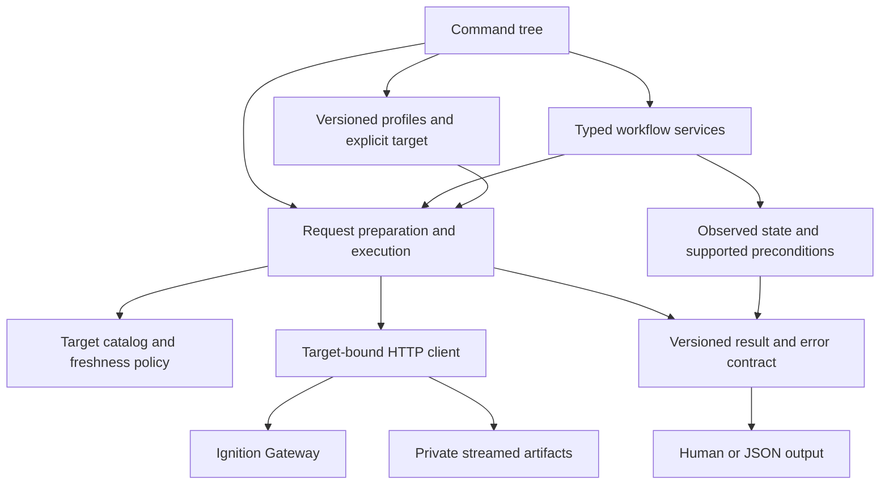

# Architecture

`igw` is a thin operational client for an Ignition Gateway. Its core task is to
turn a documented API contract and an explicit target into a prepared request,
then distinguish request acceptance from a verified workflow outcome.

One Cobra command tree in `internal/cli` defines parsing, help, completion, and
machine command schemas. Handlers construct typed requests or workflow inputs;
workflow services never re-enter an argument parser. `cmd/igw` owns process
signals and maps errors to the stable exit codes. The old CLI, persistent RPC,
CWD OpenAPI index, and WSL address helper have been removed.

## Boundaries

| Package | Responsibility |
| --- | --- |
| `internal/cli` | One command definition source; input selection and rendering |
| `internal/config` | Strict v1 configuration, precedence, local previews, revisions, migration, rollback |
| `internal/catalog` | Full OpenAPI model, operation identity, validation, provenance, snapshots, freshness, pins |
| `internal/execute` | Typed preparation, target binding, shared workflow scopes, bounded batches, execution outcomes |
| `internal/gateway` | HTTP origin/credential policy, cancellation, bounded responses, redirect/retry restrictions |
| `internal/artifact` | Private upload snapshots, streamed downloads, hashes, complete publication |
| `internal/resource`, `project`, `tag`, `operations` | Workflow inputs, preconditions, readback, and honest verification boundaries |
| `internal/workflow` | Reviewed route prerequisites for advertised capabilities |
| `internal/result` | `igw/v1` envelope, outcomes, redacted errors, exit codes |
| `internal/reference`, `referencebuild`, `testgateway` | Offline reference distribution and reproducible real-Gateway qualification |

Keep Go and standard-library transport/filesystem primitives. Cobra removes
separate registries for help, parser, completion, and schemas. Libopenapi and
its validator sit behind the catalog boundary; their behavior is tested against
retained vendor captures. Narrow version/hash-scoped vendor corrections stay
separate from original bytes and appear in inspection output.

## Authority and availability

The selected Gateway's `/openapi.json` describes routes for its version and
installed modules. `/openapi` is a documentation UI. Actual Gateway responses
and validation determine state, authorization, and undocumented behavior.
Reviewed workflow policy supplies effect classification, retry eligibility,
preconditions, and completion evidence. No one layer substitutes for another.

Catalogs are partitioned by profile and normalized effective URL, including
proxy base paths. Keep immutable raw documents and provenance, validate before
promotion, and retain the last valid snapshot after refresh failure. Schema-
assisted writes refresh within the invocation; stale use is explicit. Pins bind
contract identity. Offline imports and bundled references are identified as
references and never silently become live-target authorization.

Qualified reference bundles include the original compressed document, checksums,
version/module/image provenance, and qualification scope. They are embedded for
offline availability and can be exported independently. Scheduled capture/update
code exists; remote activation and final-source qualification remain governed
by `docs/reference-updates.md` and the full rebuild plan.

## Execution and safety contracts

`Prepared` binds the target, operation, encoded inputs, preview, and validation
metadata. Operation identity is method plus path; operation IDs are aliases only
when unambiguous. Vendor server URLs and external references cannot redirect
credentialed traffic or trigger arbitrary reference loading.

A workflow acquires a shared catalog scope, reads baseline state, prepares an
explicit change, applies supported preconditions, sends one deliberate mutation,
and checks the resulting state. Previews may read state but never send that
mutation. Generic success is `accepted`; verified workflows can be `completed`.
A transport failure after dispatch may be `uncertain`; writes are not replayed.

Downloads remain private until complete, with explicit overwrite and bounded
sizes. File-system and platform atomicity limits are documented rather than
inferred from a successful rename. Configuration migration preserves legacy
bytes and rollback archives v1 before returning to unchanged legacy settings.

Flags override environment, which overrides configuration. Environment names
remain `IGNITION_GATEWAY_URL` and `IGNITION_API_TOKEN`. Credentials are excluded
from output, command-line token values, response-error diagnostics, and previews.
Exit codes remain 0/2/6/7. Every mutation requires `--yes`.

## Scope and evidence

The single-entrypoint cutover does not establish v1 readiness. Structured input
encodings, broader workflow qualification, performance with actual captures and
large artifacts, release artifacts, and final-source Gateway acceptance remain
subject to `docs/plans/rebuild-v1.md`. Historical receipts retain their original
source, parser, image, and timestamps; recompiling or renaming a package does
not renew their qualification.

Persistent RPC, MCP, fleet control, and desired-state orchestration are excluded.
Host tools spawn a bounded CLI process or use explicit sequential batches.
No repository workflow repairs WSL/Docker Desktop or changes host memory.
